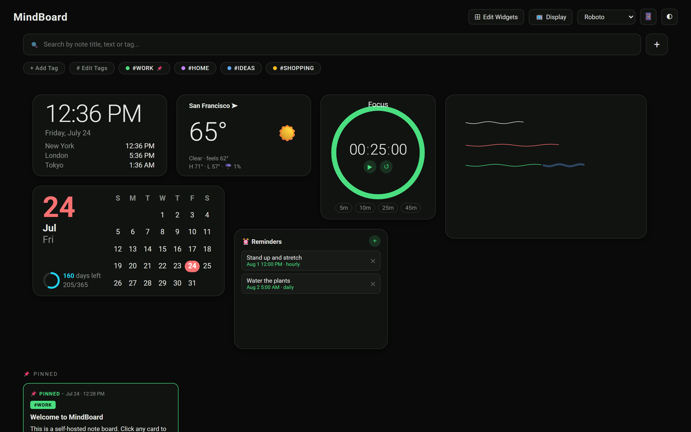
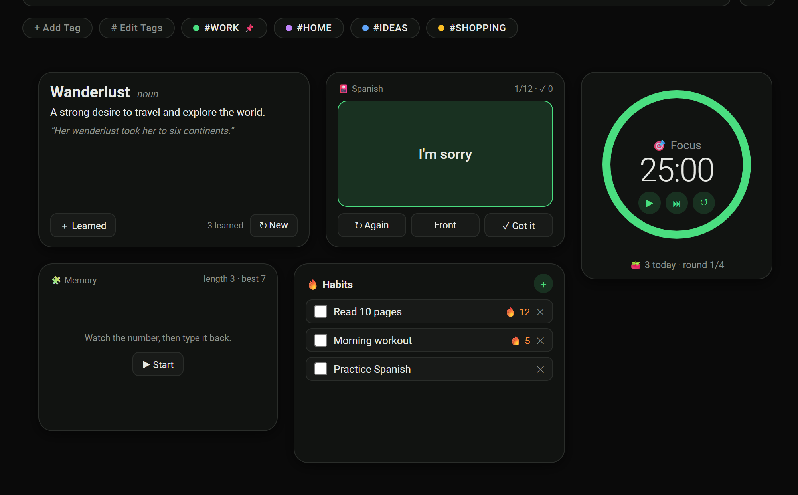

# 🧠 MindBoard

A self-hosted, MindChuk-inspired note & project board. One lightweight Node.js
server, zero database service, dark-mode-first design — built to run on a
Raspberry Pi, a home-lab Docker host, or your laptop.



## Features

**Notes**
- Masonry card board with created / edited timestamps on every card
- Tags with colors — quick-filter bubbles under the search bar, pinnable tags
- Full-text search across titles, note text, checklist items and tag names
- To-do lists inside notes with checkboxes and progress counters
- Image attachments (uploaded and stored server-side)
- Colored note outlines + per-note text color
- Pin notes to a dedicated section at the top of the board
- Right-click context menus (pin, recolor, remind, edit, delete)

**Widgets** — drag-and-drop dashboard widgets, freely positionable and resizable
- ✍️ **Whiteboard** — full-screen handwriting canvas, optimized for iPad +
  Apple Pencil (pressure-sensitive ink, palm rejection, pen/highlighter/eraser,
  undo/redo, 9 colors)
- 🕐 **Clock** — big local time plus world-clock rows for cities you choose
- ⏱ **Timer** — scroll-wheel adjustable HH:MM:SS, named timers, presets,
  progress ring, optional Telegram notification when done
- 📅 **Calendar** — month grid with today highlighted, days-left-this-year ring,
  dot markers on days that have reminders
- 🌤 **Weather** — Open-Meteo powered (no API key needed), city search, °F/°C
- ⏰ **Reminders** — quick standalone reminders with once/hourly/daily/weekly
  recurrence
- 📖 **Word of the Day** — a built-in vocabulary set with definitions and
  examples; a new word daily, mark words as learned
- 🎴 **Flashcards** — language decks (Spanish, French, German, Italian,
  Japanese) with tap-to-flip and shuffle
- 🍅 **Pomodoro** — focus/break cycles with a progress ring, daily session
  count, and Telegram alerts on each phase change
- 🧩 **Memory Trainer** — a digit-span brain-training game that grows with you
  and tracks your best score
- 🔥 **Habits** — daily habit checklist with automatic streak counting



**Reminders & Telegram**
- Attach reminders to notes (date, time, frequency) or create standalone ones
- A Telegram bot bridge delivers reminder notifications, timer-done alerts, and
  lets you **text notes onto the board** — messages (and photos) sent to your
  bot appear as notes tagged `#TELEGRAM`
- The bot locks itself to the first chat that messages it — nobody else can
  post to your board

**UI**
- Dark & light mode, remembered per device
- Font switcher: Roboto, Roboto Mono, Courier
- Responsive mobile layout with auto-detection + manual 📱/🖥 override
- 📺 **Display mode** — a read-only page that auto-refreshes every 5 minutes
  with Today / This Week / This Month / All filters, made for wall-mounted
  tablets and status screens

More screenshots and walkthrough demos live in [`/design`](design/).

## Quick start

```bash
git clone https://github.com/tjbmoose09/mindboard.git
cd mindboard
npm install
npm start
```

Open http://localhost:3113. That's it — data lives in `./data/db.json`,
uploads in `./data/uploads/`.

### Environment variables

| Variable | Default | Purpose |
|---|---|---|
| `PORT` | `3113` | HTTP port |
| `DATA_DIR` | `./data` | Where notes, uploads and settings are stored |
| `TELEGRAM_BOT_TOKEN` | *(unset)* | Enables the Telegram bridge when set |

## Docker

```bash
docker build -t mindboard .
docker run -d --name mindboard \
  -p 3113:3113 \
  -v mindboard_data:/app/data \
  -e TELEGRAM_BOT_TOKEN=your_token_here \
  mindboard
```

Or with compose:

```yaml
services:
  mindboard:
    build: .
    container_name: mindboard
    restart: unless-stopped
    ports:
      - "3113:3113"
    volumes:
      - mindboard_data:/app/data
    environment:
      TELEGRAM_BOT_TOKEN: your_token_here   # optional
volumes:
  mindboard_data:
```

## Telegram setup (optional)

1. Talk to [@BotFather](https://t.me/BotFather) in Telegram → `/newbot` →
   copy the API token.
2. Start MindBoard with `TELEGRAM_BOT_TOKEN` set (env var, or an `env_file` in
   your compose setup — don't commit the token).
3. Send your bot any message. It replies with a 🔒 lock confirmation — from now
   on only your chat can post to the board, and reminders/timer alerts are
   delivered there.

The bridge uses long polling, so it works behind NAT with **no public webhook,
open ports, or reverse proxy required**.

## Security notes

- MindBoard has **no built-in authentication.** Run it on a trusted network,
  behind a VPN (Tailscale/WireGuard), or behind an authenticating reverse
  proxy — do not expose it directly to the internet.
- The `data/` directory contains all of your notes, uploaded images, and your
  Telegram chat id. It is gitignored for a reason — never commit it.

## Tech

Vanilla JS + CSS front end (no framework, no build step), Express + Multer on
the back end, JSON file storage with atomic writes. The whiteboard uses pointer
events with coalescing and pressure support; widget text scales with CSS
container queries.

## License

[MIT](LICENSE)
